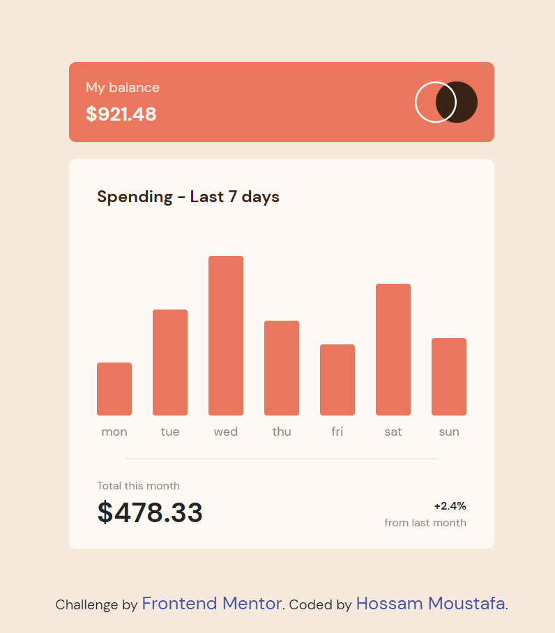

# Frontend Mentor - Expenses chart component solution

This is a solution to the [Expenses chart component challenge on Frontend Mentor](https://www.frontendmentor.io/challenges/expenses-chart-component-e7yJBUdjwt). Frontend Mentor challenges help you improve your coding skills by building realistic projects.

## Table of contents

- [Overview](#overview)
  - [The challenge](#the-challenge)
  - [Screenshot](#screenshot)
  - [Links](#links)
- [My process](#my-process)
  - [Built with](#built-with)
  - [What I learned](#what-i-learned)
  - [Continued development](#continued-development)
  - [Useful resources](#useful-resources)
- [Author](#author)

## Overview

### The challenge

Users should be able to:

- View the bar chart and hover over the individual bars to see the correct amounts for each day
- See the current day’s bar highlighted in a different colour to the other bars
- View the optimal layout for the content depending on their device’s screen size
- See hover states for all interactive elements on the page
- **Bonus**: Use the JSON data file provided to dynamically size the bars on the chart

### Screenshot

### Links

- Solution URL: [https://github.com/hossammoustafa404/expenses-chart-component.git]
- Live Site URL: [https://expenses-chart-component1.netlify.app/]

## My process

### Built with

- Semantic HTML5 markup
- CSS custom properties
- Flexbox
- Mobile-first workflow
- [React](https://reactjs.org/) - JS library
- [Styled Components](https://styled-components.com/) - For styles
- [Bootstrap](https://getbootstrap.com/) - Frontend toolkit

### What I learned

I have learned how to fetch local data from data.json.

### Continued development

I am going to practice more to get perfect file structure in react.

### Useful resources

- [PLURALSIGHT](https://www.pluralsight.com/guides/fetch-data-from-a-json-file-in-a-react-app) - I have learned how to fetch local data from data.json with the help of this website.

## Author

- Github - [Hossam Moustafa](https://github.com/hossammoustafa404)
- Frontend Mentor - [@hossammoustafa](https://www.frontendmentor.io/profile/hossammoustafa404)
- Facebook - [@myname22744](https://www.facebook.com/myname22744)
